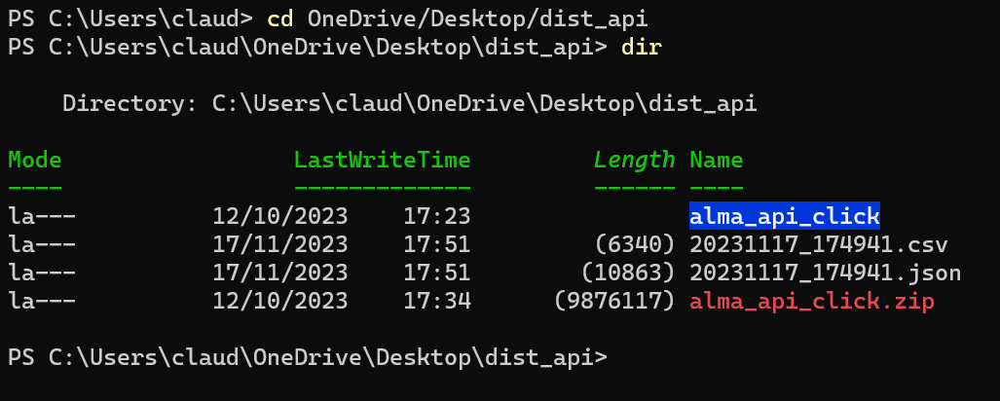
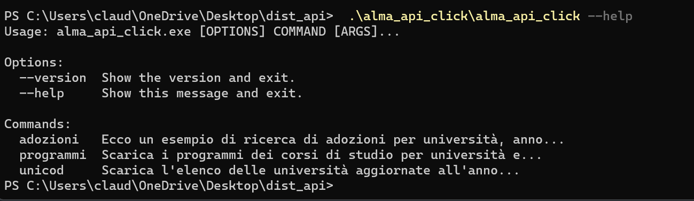

# ALMADATI Le API di Almalibri

Applicazione per ricercare e scaricare records da terminale, in formato `json` e `csv`, dalla banca dati [Almalibri](https://almalibri.it). L'accesso è riservato agli abbonati che al momento della sottoscrizione hanno comunicato il proprio indirizzo IP e alcuni campi facoltativi a cui sono interessati. Esistono, per ora, solo versioni Windows e Ubuntu 22 di questa applicazione. Chi fosse interessato ad altri sistemi operativi può comunicarcelo. La versione compilata comparirà in questa pagina.  
&nbsp;
&nbsp;
Ecco un esempio di come sia possibile utilizzare l'applicazione.  
Scaricate il file zip e decomprimetelo dove preferite, ad esempio sul desktop. Le figure presentano un esempio su una macchina Windows. Con linux e altri OS le operazioni sono sostanzialmente simili.  
&nbsp;
&nbsp;

_Fig. 1. Il file alma_api_click.zip è stato decompresso nella cartella alma_api_click. I file csv e json hanno come nome, in questo caso, la data in cui sono stati generati_ 
&nbsp;
&nbsp;
Da terminale dovrete lanciare il file `alma_api_click.exe`, in Ubuntu `alma_api`, aggiungendo tutte le opzioni necessarie. Se è il caso il file andrà reso eseguibile.
&nbsp;
&nbsp;

&nbsp;
&nbsp;
_Fig. 2. L'help elenca le tre diverse funzionalità disponibili_
&nbsp;
&nbsp;
I comandi disponibili sono:

- **unicod**   Genera l'elenco delle università disponibili, con l'anno accademico dell'ultimo aggiornamento. Non vi sono opzioni aggiuntive.
- **programmi**  Scarica le bibliografie dei corsi di studio (sia i testi sia le eventuali annotazioni del docente) riportando anche il campo  ``insegnamento_id`` utile per il collegamento ai dati scaricati con il comando ``adozioni``. E' possibile specificare il nome del file (senza estensione); senza indicazione del nome del file verrà usata la data e l'ora del download. Le opzioni per selezionare i corsi sono le seguenti:  
`--uni_cod [required]  
--a_a [required]  
--laurea_nome  
--laurea_tipo  
--laurea_classe_cod  
--curr_nome  
--materia_nome  
--materia_ssd_cod  
--curr_materia_anno  
--curr_materia_periodo  
--insegnamento_prof  
--isbn  
--autori  
--titolo  
--editore  
--testo_obb  
--page`
- **adozioni**  Scarica l'elenco delle adozioni delle università e dei corsi selezionati. E' possibile specificare il nome del file (senza estensione); senza indicazione del nome del file verrà usata la data e l'ora del download. Le opzioni per selezionare i corsi sono le seguenti:  
`--uni_cod  [required]  
--a_a [required]  
--laurea_nome  
--laurea_tipo  
--laurea_classe_cod  
--curr_nome  
--materia_nome  
--materia_ssd_cod  
--curr_materia_anno  
--curr_materia_periodo  
--insegnamento_prof  
--isbn  
--autori  
--titolo  
--editore  
--testo_obb  
--page`
